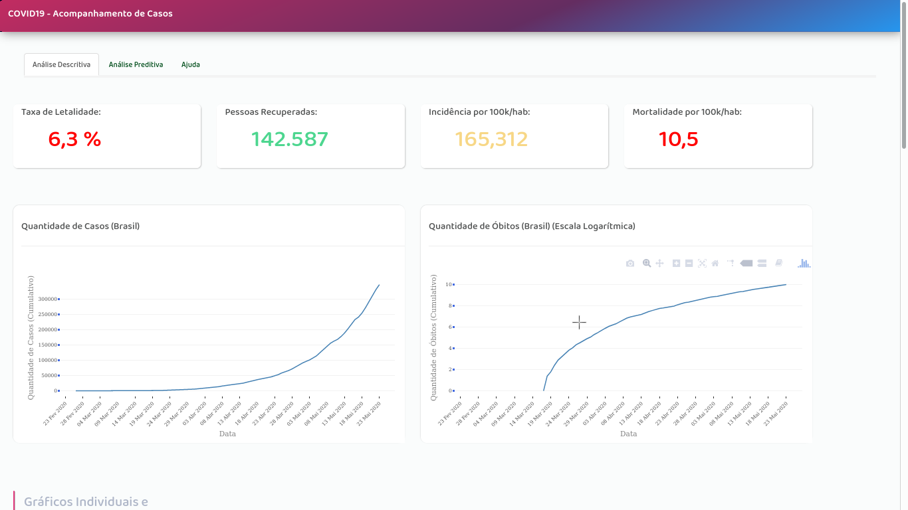

# COVID19-app

### Aplicativo Web feito em Shiny --framework R para desenvolvimento de single page web apps-- criado com o intuido de treinar minha stack web-bi.

[Link do App](https://jailsonrs.shinyapps.io/C19Viewer/)

